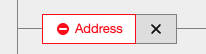

# SP-EU App ("wisen") User Manual

The SP-EU App called "Wisen" supports the research phase of the Social
Prescribing EU project. It is targeted towards link workers. The app
provides a web user interface to search, view, and manipulate
information that is relevant to common link working activities. The
kind of information that the application manages includes
organizations, events, and offers.

The app heavily builds on web standards and open-source software. (1)
The bedrock of the app information architecture is Semantic Web and
the Resource Description Framework. (2) On top of this bedrock, the
app provides a web frontend. (3) The technical foundation is based on
the open-source version control management software Git.

## Semantic Web and RDF

The world wide web is a vast collection of federated information. In
the web there is no central authority that gatekeeps what information
is allowed to be published. Anyone can say anything about any topic
(AAA) on the web. The conventional web is primarily targeted towards
human readers, however, so this information is hard to process
computationally. The "Semantic Web" improves on this model. It keeps
the AAA principle and merely suggests a set of technical devices that
make the information more structured and therefore amenable to
computer processing. The Resource Description Framework (RDF) is the
central technical device of the semantic web. RDF data describes
(parts of) a single large shared information graph. Nodes in this
graph denote resources such as organizations, events, people,
etc. Nodes are always unique URIs such as
`https://commission.europa.eu`.  Edges between nodes denote
relationships, e.g. the relationship `parentOrganization` can relate
`https://commission.europa.eu` with the European Union itself
(`https://european-union.europa.eu/`). Edges are therefore triples
consisting of a subject (EU Commission), a predicate (has parent
organization), and an object (EU). These triples can be published by
anyone on the web. Users of the semantic web can then mix and match
their own information graphs by combining different sets of triples.

The set of possible edges are usually standardized by a given
vocabulary. By default the wisen web app uses the
[schema.org](https://schema.org) vocabulary which is tailored to
information about organizations, events, offers, etc.

## The web application

The [Wisen web application](https://sp-eu.active-group.de) provides a
simplified interface to the RDF graph described above. It allows link
workers to (1) search, (2) view, (3) and add and edit information.

The home page of the web app greets users with a toolbar, a
geographical map and a single search field.

The toolbar on the top of the screen allows to quickly access the
search screen ("Search", which we're currently on), create some new
information ("+ Organization", "+ Event", "+ Offer", and "+ RDF") to
insert into our information graph, and switch the user interface
language (currently "en" for English).

### Search

On the search screen, you can zoom and pan the map and enter relevant
search terms in the search field below. When you click the search
button (labelled "Search" or "Search everything"), a search request is
performed according to the given map area and the search term. When
the request succeeds, you are presented with the relevant search
result below the search area.  If you don't enter a search term, then
every information associated with the current map area is returned.

The search result is a part of the information graph. This may at
first appear unintuitive. In most other software, the output of a
search request is a list of results. While it may often appear as
though the Wisen app also outputs a list, this is technically not
true; it outputs (part of) a graph.

### View

The graph view displays nodes and edges as described above.

Here we see four nodes:

* `http://localhost:4321/resource/9fcd7cfe-0d05-4eb8-82c0-e5d3f634927f`
* "Organization"
* "Active Group GmbH"
* `http://localhost:4321/resource/d1286319-d0d2-482c-b084-87f7fbca1657`

And we see three edges connecting these nodes:

* "Type"
* "Name"
* "Location"

We can read this information as: The node
`http://localhost:4321/resource/9fcd7cfe-0d05-4eb8-82c0-e5d3f634927f`
has type "Organization", is named "Active Group GmbH", and has a
location which is described by the node
`http://localhost:4321/resource/d1286319-d0d2-482c-b084-87f7fbca1657`. If
we were further interested in the specifics of the location, we would
have to follow the latter URI's outgoing edges (ommitted in the
screenshot).

The URI of nodes can be copied to the pasteboard ("Copy") and we can
refresh the outgoing edges with the "Refresh" button. In the
screenshot above we also see that the URI
`http://localhost:4321/resource/9fcd7cfe-0d05-4eb8-82c0-e5d3f634927f`
has no ingoing references ("No references"), but the node
`http://localhost:4321/resource/d1286319-d0d2-482c-b084-87f7fbca1657`
has one reference. If we were to click on the label "1 reference in
total", we would of course see that this reference is the former URI.

Next to nodes you also see an "Edit" button. This enters the "Edit
mode" for the current node.

### Edit

You can enter edit mode by clicking the "Edit" button next to a
node. Some screens (such as "+ Organization" described below) start
with the edit mode already. The general layout of edit mode is the
same as in view mode but in the edit mode you have access to a few
more controls.

All edits you perform in edit mode are recorded but not yet
finalized. As soon as you make your first edit, a "commit bar" appears
on the bottom of the screen. 

The commit bar shows a short summary of your edits ("1 Additions 2
Deletions"). You can finalize ("commit") your changes by using the
"Commit changes" button. After hitting "Commit changes" a loading
spinner appears. After a short while, your commit is either
successfully registered or you are presented with an error. In the
success case the commit bar disappears and the nodes and edges are
displayed with the edits applied. In the error case, you are presented
with options to proceed. In most cases it is enough to "Retry" the
commit.

#### Delete edges

You can delete edges by using the little "x" button next to the edge's
label. As described above, deleting an edge does not yet mean that the
edge disappears. Instead, your deletion request is recorded as a
desired change. You can discard a deletion by clicking the (now different
looking) "x" button next to the edge's label again.

#### Insert edges

You can insert new edges by using the control at the bottom of the
list of outgoing edges ("Add property").

With the left dropdown menu you can choose the desired predicate. The
dropdown only allows you to insert valid (according to schema.org)
predicates for the given node's type.

When you click the "Add property" button, a new edge is inserted with
the given predicate and a default object (which depends on the
predicate). For example, if you insert an edge with the "Name"
predicate, an edge is inserted with an empty string as the object.

##### Smart insert

There is an experimental feature that allows you to use a
large-language model to insert and update edges with natural
language. To enter the smart insert mode, use the lightbulb icon next
to the insert control.

Here you can express your desired edges in a text box. After you
"Submit" your prompt, the system takes a while to process and then
presents you with a result graph. You can review if the proposed graph
is what you desire to insert.

In the positive case, you can choose to either "Insert" the proposed
edges, which will add the edges to the ones that were already attached
to the corresponding node. You can also choose to "Replace" the old
edges with the new ones. In this case all old edges will be marked as
deleted and the new ones will be marked as inserted.

In the negative case, if you are not yet satisfied with the proposed
edges, you can refine them by further presenting text to the large
language model. When you are done, you can exit the smart insert mode
with the "Cancel" button on the bottom.

#### Change edge objects

Edge objects can either be nodes or primitive values such as text,
dates, or numbers. We call this distinction the "kind" of a
value. Some edges allow you to choose objects from two or more
kinds. In these cases there is a dropdown menu such as in the
following screenshot.

For primitive values there is a simple input control next to this
dropdown. You can perform changes by using these input controls. As
soon as you change a value for the first time, the object is wrapped
in a change control and the edge is annotated accordingly.

The change control allows you to revisit the old state of the object
via a "Before" tab. The old state, of course, cannot be edited (it is
a fact). If you want to further edit a primitive, you have to use the
"After" tab.

If you want to discard a change entirely, you can use the little "x"
button next to the corresponding edge.

##### Changing node references

Changing an object that is a node works differently. You can set a
node by setting its reference with the "Set reference" button.

This opens a modal view with an input for the new reference. You can
enter the desired reference and confirm the change with the "Set
reference" button on the bottom bar. Note that it is your
responsibility that the text you enter is a valid reference. Valid
references are either URIs or integers denoting "existential" nodes –
nodes which do not yet have a URI but will be created after the
current set of edits is committed. The integers referencing
existential nodes are only valid within the current edit session.

### Insert

You can insert information related to existing nodes in edit mode as
described above. However, if you want to insert completely new
information, you have a number of additional tools.

#### New organizations, events, offers, ...

The toolbar at the very top of the app screen displays four buttons:
"+ Organization", "+ Event", "+ Offer", and "+ RDF". If you use any of
the first three buttons, a modal opens with some predefined default
information. You can edit this information as usual and hit "Commit
changes" to finalize these edits.

The "+ RDF" button works a bit differently. This button opens a modal
view with a split screen of a large text input on the left and a
result graph view on the right. Here you can insert a graph as text in
the "JSON-LD" format. The view on the right will show what this text
representation looks like in terms of nodes and edges.

How is this screen useful? JSON-LD is a format that is well understood
by off-the-rack large language models such as ChatGPT, Claude, or
Google Gemini. You can ask any of these models to translate some
information into JSON-LD with schema.org vocabulary. Then you can
insert the resulting JSON-LD text into this view.

For example, you can ask ChatGPT to translate the information on [this
website](https://rudelapp.de/rudel/seniorentreff-rengschburger-herzen/)
to JSON-LD using schema.org vocabulary.

You can then "Copy code" this JSON-LD text and paste it into our "+ RDF" screen.

Again, you can finalize these changes with the "Commit changes" button.

## Git storage

Wisen stores triples – i.e. a semantic web graph – as plain text files
in a Git repository. Users of the web interface do not have to be
concerned with this choice but power users can leverage this
architecture to their benefit. There are many tools from other vendors
that can view and manipulate these plain text files
(e.g. [Protégé](https://protege.stanford.edu)). These tools can be
used for wisen data without restrictions.

The Git repository is currently not open to the public. If you require
access, please contact [Markus
Schlegel](mailto:markus.schlegel@active-group.de).
